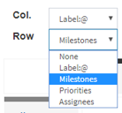

# gitbucket-label-kanban-plugin

A [GitBucket](https://github.com/gitbucket/gitbucket) plugin for Kanban-style issue management.  
The lanes are labels prefixed with "@", milestones, priorities and assignees.   

## Installation

Download jar file from [the release page](https://github.com/kasancode/gitbucket-label-kanban-plugin/releases) and put it into `GITBUCKET_HOME/plugins`.

## Version

Plugin version|GitBucket version
:---|:---
3.6.0 - |4.34.x - 
3.3.0 - 3.5.0|4.32.x - 4.33.x
3.0.x|4.26.x - 4.31.x
2.0.x|4.26.x - 4.31.x
1.0.x|4.26.x - 4.29.x

## Build from source

`$ sbt assembly`

## Usage

1. Click "Add lane" button to add lanes (prefixed labels).  

1. Select the lane type.   

1. Drag an Issue to another lane.   

