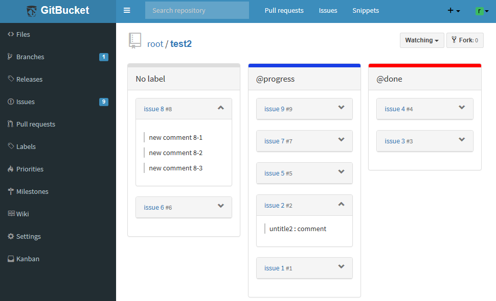
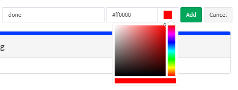

# gitbucket-label-kanban-plugin

A [GitBucket](https://github.com/gitbucket/gitbucket) plugin for Kanban-style issue management.  
The columns are labels prefixed with "@".   

## Installation

Download jar file from [the release page](https://github.com/kasancode/gitbucket-gantt-plugin/releases) and put it into `GITBUCKET_HOME/plugins`.

## Version

Plugin version|GitBucket version
:---|:---
1.0.x|4.26.x -

## Build from source

`$ sbt package`

## Usage

1. Click "Add Column" button to add columns (prefixed labels).
1. Drag an Issue to another column.

